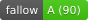

# francescoimola.com

 [](LICENSE.md)

I make delightful things with pixels and words. This is my half-portfolio, half-marketing site, built with Eleventy, cleacss, LightningCSS, and Cloudflare Pages as a host.

## Stack

| | |
|---|---|
| **Static site** | [Eleventy 3](https://www.11ty.dev/) |
| **Templates** | Nunjucks |
| **CSS** | SCSS → LightningCSS, OKLCH colors, `light-dark()` |
| **Type & spacing** | [Utopia](https://utopia.fyi/) fluid scale |
| **Font** | Ronzino (humanist sans-serif, woff2) |
| **Package manager** | pnpm |

## Getting started

You'll need Node 22+ and pnpm.

```bash
pnpm install
pnpm start        # dev server with live reload
pnpm build        # production build → public/
pnpm test         # run the test suite (vitest)
```

As far as the basics, that's it.

## Structure

```
src/
  _includes/      Nunjucks partials (base, head, header, footer, meta, schema)
  _data/          Global data (site.json)
  css/            SCSS entry point + all styles
  assets/         Fonts, favicons, portfolio videos
  config/         Eleventy config (transforms, filters, shortcodes, collections)
public/           Build output (gitignored)
```

## Highlights

- Brand tint: I can swap the entire colour palette by changing --brand-hue and --brand-chroma. 
- Light/dark mode is automatic via light-dark(), plus there's a manual toggle with data-theme.
- Lazy video: IntersectionObserver loads project videos only when they scroll into view and prefers-reduced-motion and slow connections are respected, within what's feasible.
- Content modes: by setting "contentMode: contrast" in frontmatter, I can make pages either white or slightly tint them with the brand colour.
- Fluid type using Utopia, which generates a scale from 16px to 24px with a Perfect Fourth ratio.
- Running on 100% renewable energy infrastructure. Cloudflare Pages is certified green by The Green Web Foundation.

## License

[GPL-3.0](LICENSE.md) — see [LICENSE.md](LICENSE.md) for full text.
