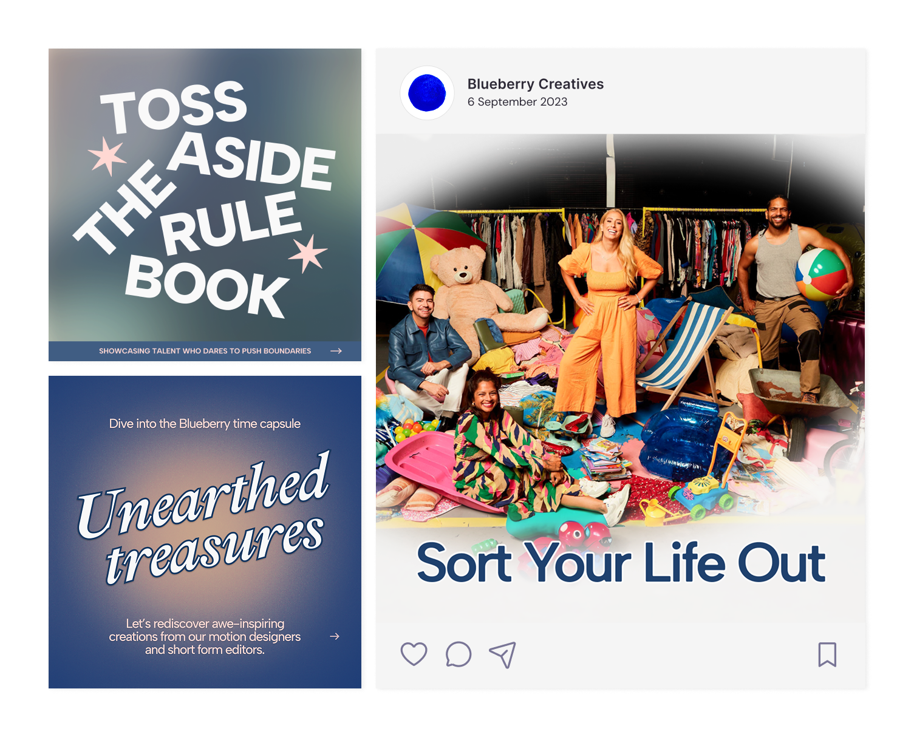
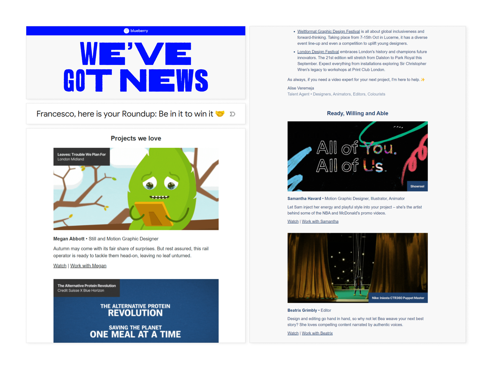
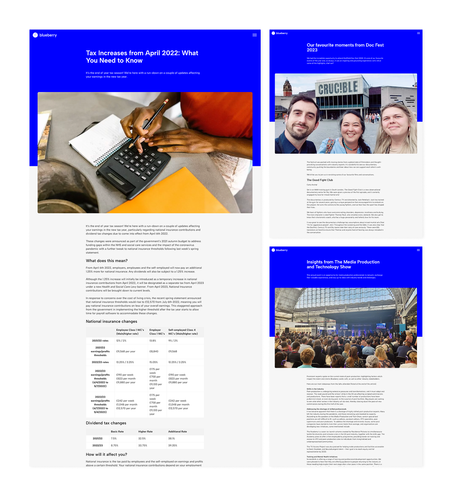
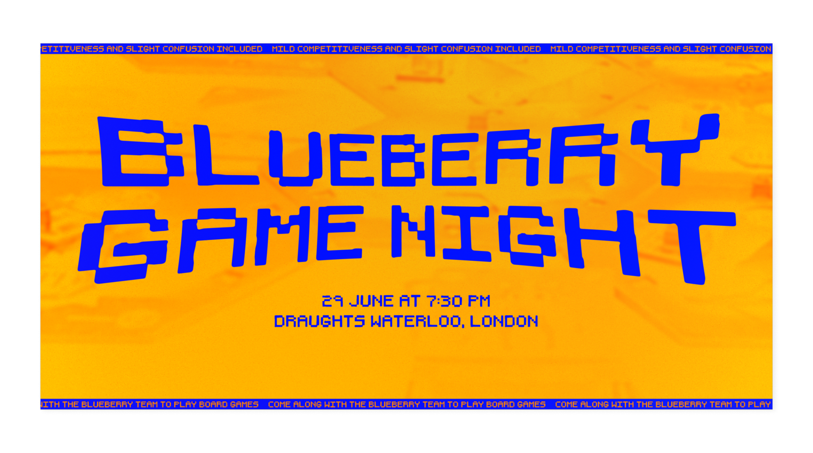
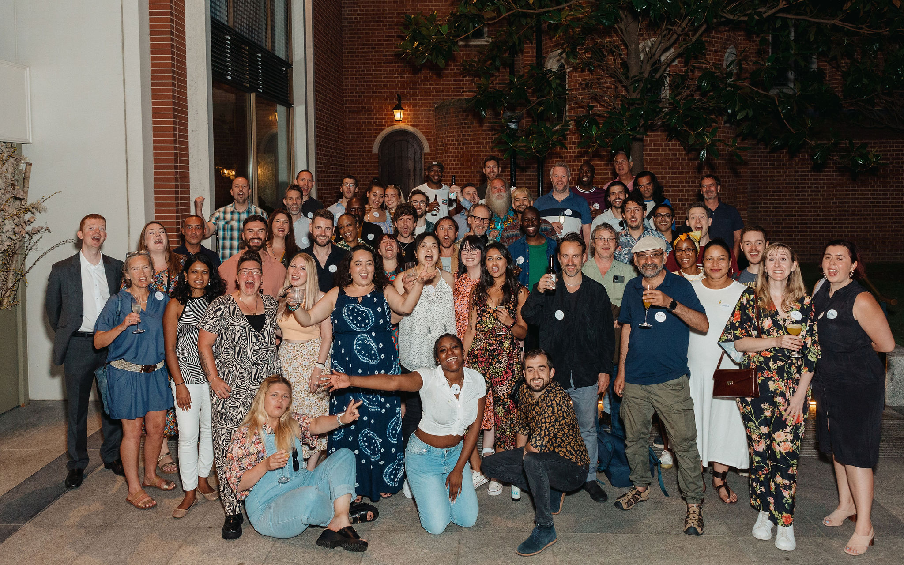

Four months into what was essentially a team assistant role, I was asked to coordinate Blueberry's marketing and communications. I don't think that says anything extraordinary about me — but it does say a lot about how much needed doing and that someone with guts and focus had to own it. The role covered project management, operations, brand, content, and events. None of it came with a big budget.

## Getting the house in order

The first problem of the marketing department was operational. The company was paying for a stack of tools that either overlapped or just weren't being used properly. Social media management and assorted subscriptions, the usual accumulation that happens when no one's had time to step back and ask what's actually needed. 

A few months into the role, I audited the lot, consolidated where I could, and moved all marketing operations into Monday CRM. By the end of my second year, yearly marketing costs had dropped by a third while quality and output stayed the same or improved. 

Before Monday, marketing had operated as a standalone thing and somewhat disconnected from the rest of the company, in part because it had always been a one person operation. Building it into the same system everyone else used meant the wider team could see work in progress, share ideas with us, and for the first time understand what the marketing staff was actually doing and why. It also meant I had a proper base to run campaigns, manage content, and keep track of everything without it living in someone's inbox. I also worked with Compliance Manager to set up processes for GDPR and email list hygiene -- talk about unsexy work, but I trust it saved the business from a world of pain down the line. 

## A slow pivot

Senior management had no shortage of ideas. The challenge was that many of them pulled in different directions. My job was to take all of them, find the thread, and execute what made sense, in a way that made sense. 

I learned what our competitors -- often bigger agencies with deeper pockets or larger teams -- were focusing on and I pushed for us to do the same, but better. An impossible challenge, I know, but trying did result in making hundreds of new talents reach out to join us, and encouraging more of our current clients to stay loyal.

As well as the administrative work noted above, getting to this place involved creative and strategic thinking, designing, and editing all of Blueberry's promotional content and internal communications. Think features in trade magazines, email campaigns, event graphics, talent bios and blog posts. My role also extended to email marketing, where I oversaw everything from managing our lists, designing email templates, reporting, strategy and editing content. Soon enough, the efforts paid off and we doubled our email open rates in the space of two years.

Design-wise, I aimed for lean, typography-driven work that let great images do the heavy lifting. When great images weren't available, I made sure the copy was good enough to carry the weight. I wrote branding guidelines to keep future content consistent, and designed several post templates for social media. 

When an external design studio was hired to develop a new design language and website for us, I coordinated between external designers and the managing director to keep the project on track, and then facilitated the bulk of that design transition across all of Blueberry's outputs.

Before I left, I spent significant time with the colleagues picking up parts of my role, walking them through the systems, templates, and processes I'd built, so that none of it would depend on me being there -- that felt important.

