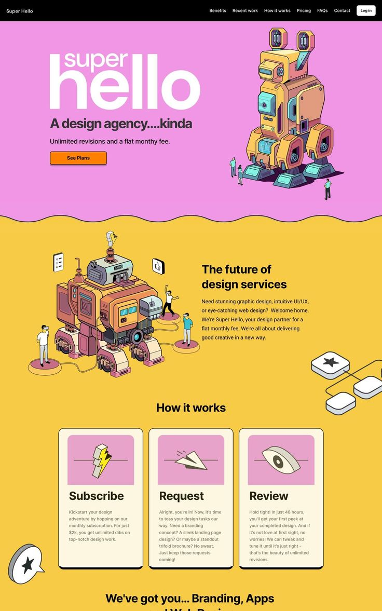

I’ve finished Prince Harry’s memoir, Spare, and my main takeaways about Harry’s older brother Prince William is that he’s no longer beautiful and that he’s never been funny. Well, someone with more connections and a better international data plan than I have needs to call up Piers Morgan, because I’ve got evidence Harry was lying. This guy’s hilarious! Plus, he looks quite fit, so I don’t know what that freaky little todger boy is talking about.

The proof is in the pud: According to Just Jared, Willy told a joke today at a food bank that was so epic and so random and so insane that every single person living below the poverty line in Great Britain laughed so hard that they pulled a groin muscle and then had to be sent to Switzerland and humanely euthanized and then Brexit was undone and Prince Andrew got his sweat glands back.
