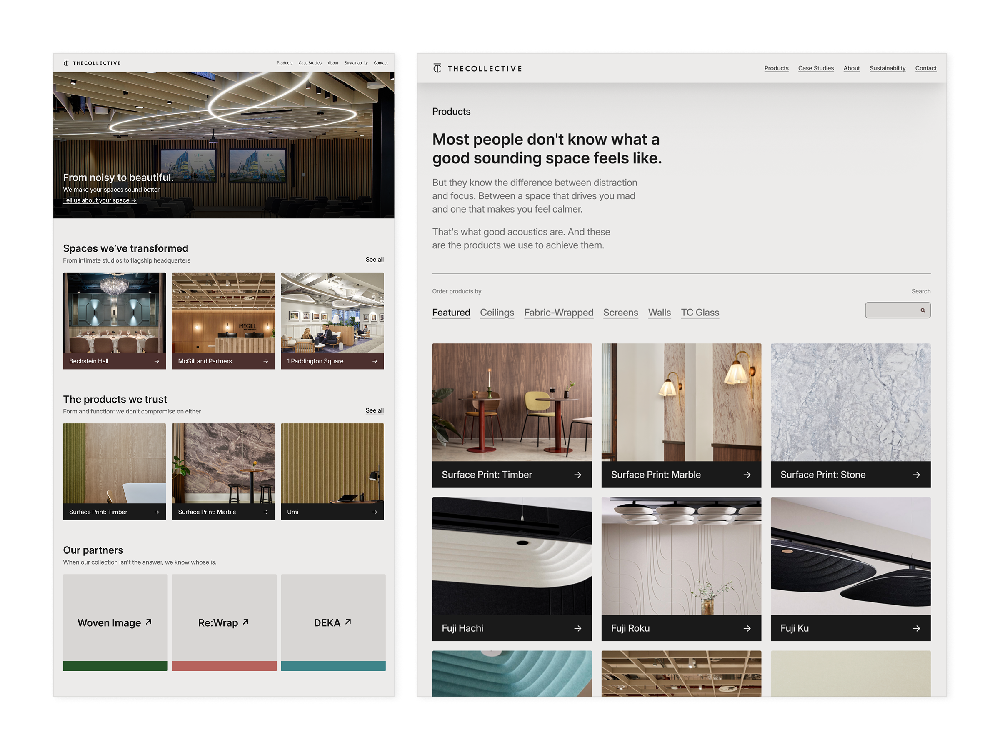
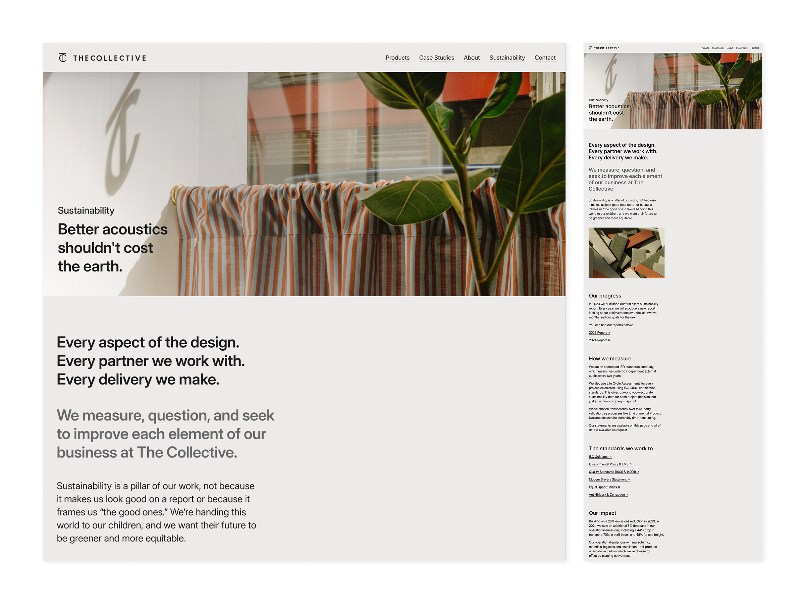

The Collective designs, manufactures, and installs bespoke acoustic solutions for commercial and residential interiors. Their clients are specifiers (architects, interior designers, and contractors) who need less marketing fluff and more technical data and reference images — and they need them quickly.

The website read like a product catalogue. But to work as a specifier's tool, it needed to surface the right products, hide all potential distractions, and make the company's end-to-end service immediately obvious.

## Discovery

Multiple working sessions with the team surfaced a central tension: the three stakeholders, all senior partners in the business, had genuinely different, if not conflicting, visions for the site. On one hand, a challenger direction. On the other, a corporate tone. And the last, a preference for simplicity. 

Meanwhile, their current site buried their strongest differentiator—that they guide clients from first consultation to final instal, and don't stop at the design stage—deep down layers of outdated design decisions and jargon.

## Phase one

I was initially commissioned to maintain the existing site structure, navigation, and CMS intact. Constraints in mind, I redesigned every page to be easier to navigate, less cluttered, and to better align with how the team actually speaks to clients face-to-face. 

Although copywriting was never formally part of the brief, my design process always starts with words. So, as well as working on the UI, I also wrote headlines and page-level copy. For example, the line 'Better acoustics shouldn't cost the earth', used on the sustainability page, came from sitting with the company's own corporate reporting, finding interesting angles, and translating it into something a visitor could get right away.

## Phase two

A couple of months in, the brief expanded to a full refresh and most constraints came off. The question at this point became: how do you satisfy three competing visions? And how do you do it without producing an incoherent mess?

I chose a primary direction and built a system flexible enough to hold elements of each vision. The team's ambition to grow into a challenger-brand set the tone, and led to a bolder palette where the brand's earthy colours got pushed toward something more distinctive. I also took the opportunity to inject some personality into the design, through the use of see-through elements and skewed images, where appropriate. 

Simplicity is the steady hand guiding the user, and it explains the generous white space, single typeface, and use of a three-column grid. The corporate weight, as hard-to-shake as it was, was accommodated through modularity and through darker, more austere card components that could shift tone without shifting direction.

'Where have I landed?' and 'Where am I going next?' were arguably the hardest questions to address in this design. When it comes to calls to action, the homepage concept I delivered reframed the website around a question the old one never asked: _what kind of space are you designing?_

That's why it starts with four categories of use case (workspaces, cultural spaces, mixed-use spaces and residential spaces), each leading to a page of curated products and projects. Further down, the 'Your journey with us' section finally visualises the entire process, from the first chat to the final installation.

## Deliverables

- Identity and UX consultation
- Competitive analysis
- Two design phases with Figma prototypes
- Page-level copywriting
- A presentation and a companion document uncovering the rationale behind every design decision

