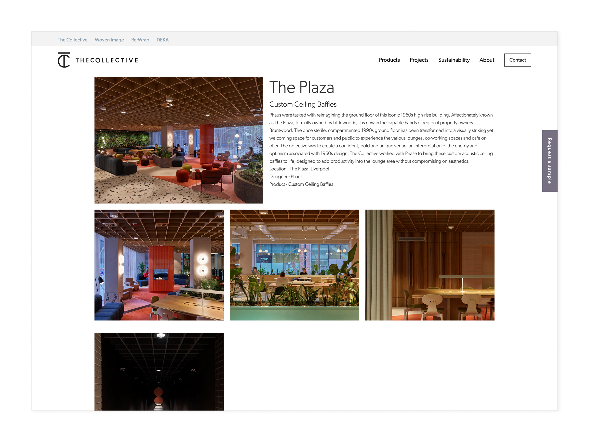
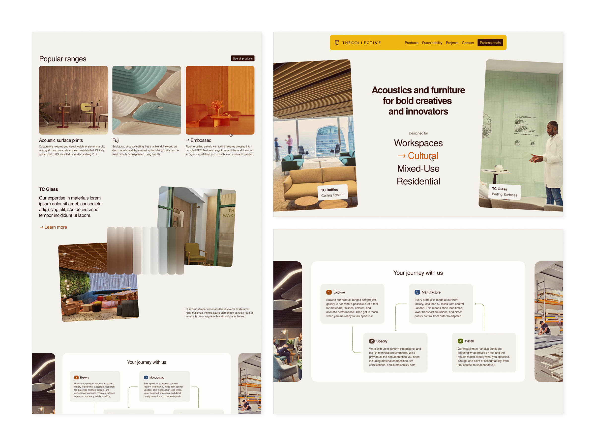
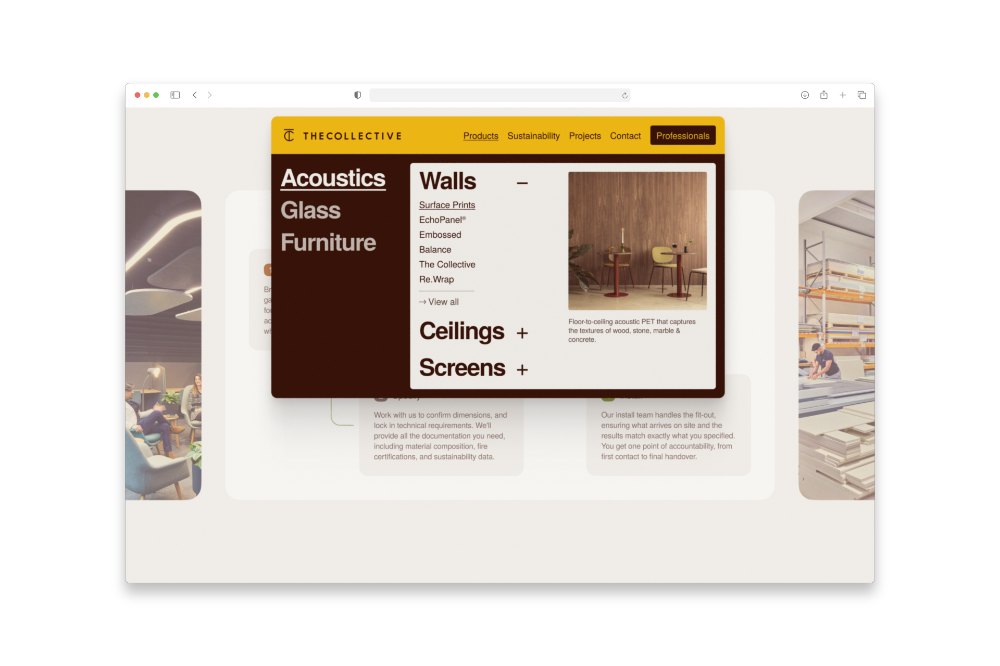
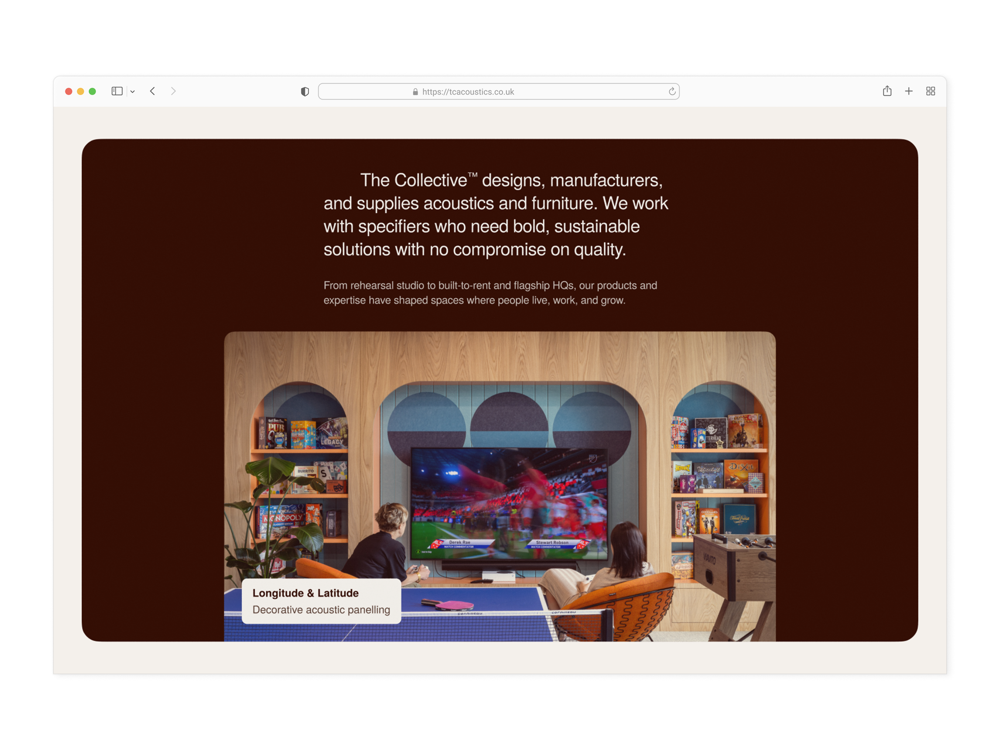
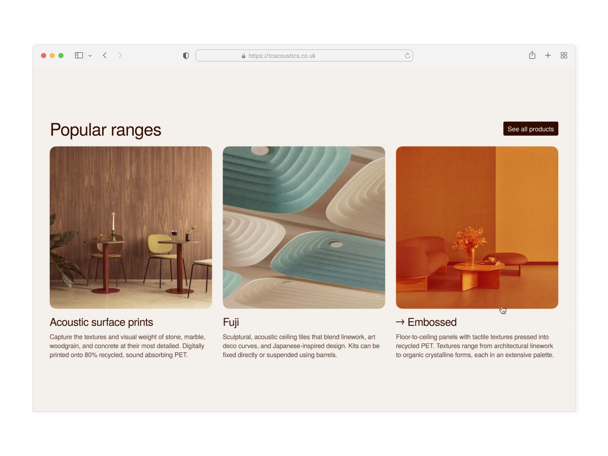
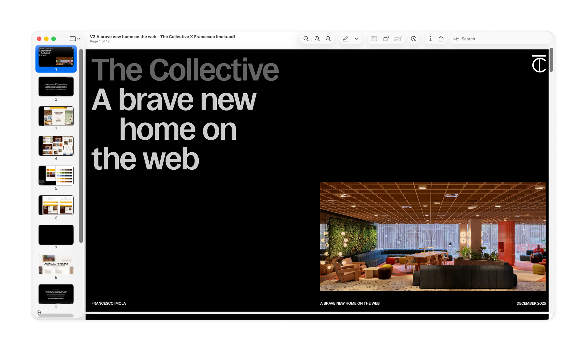

The Collective designs, manufactures, and installs bespoke acoustic solutions for commercial and residential interiors. The majority of their clients are specifiers (architects, interior designers, and contractors) who need less marketing fluff and more technical data and reference images.

Their previous website read like a boring product catalogue, but not one that was easy to navigate either. To work as a specifier's tool, we needed to fix that, and so the plan became: surface the right products, hide all potential distractions, and make the company's end-to-end service immediately obvious.

## Discovery

After multiple working sessions with the team, a central tension cropped up. The three stakeholders, all senior partners in the business, had genuinely different visions for the site. On one hand, a challenger direction. On the other, a corporate tone. And the last, a preference for the pared back and simple. 

Meanwhile, I also learned that their current site was burying their strongest differentiator—that they guide clients from first consultation to final install and don't stop at the design stage—deep down layers of outdated design and jargon.

## Phase one

I was initially commissioned to maintain the existing site structure, navigation, and CMS intact. Constraints in mind, I redesigned every page to be less cluttered and to better align with how the team actually speaks to clients face-to-face. 

Although copywriting was never formally part of the brief, my design process always starts with words. So as well as working on the UI, I also wrote headlines and page-level copy. For example, the line 'Better acoustics shouldn't cost the earth', used on the sustainability page, came from sitting with the company's own corporate reporting, finding interesting angles, and translating a key metrics into statements a visitor could get right away.

")

")

## Phase two

A couple of months in, the brief expanded to a full refresh and most constraints came off. The question at this point became: Can you satisfy three competing visions across an entire new website without producing an incoherent mess? 

I chose a primary direction and built a system flexible enough to hold elements of each vision. The team's ambition to grow into a challenger-brand set the tone, and led to a bolder palette where the brand's earthy colours got pushed toward something more distinctive. I also took the opportunity to inject some personality into the design by using some see-through elements and a few skewed images. 

Simplicity, or rather effortlessness, is the steady hand guiding the user. This explains the generous use of white space, the single typeface, and the three-column grid. As hard-to-shake as it was, the corporate weight was accommodated through modularity and through a darker, more austere card component that could be used to shift tone without shifting direction.

'Where have I landed?' and 'Where am I going next?' were arguably the hardest questions to address. When it came to CTAs, the concept I delivered reframed the website around a question the old one never asked: _what kind of space are you designing?_

That's why it starts with four categories of use case (workspaces, cultural spaces, mixed-use, and residential spaces), each leading to a page of curated products and projects. Further down, the 'Your journey with us' section finally visualises the entire process, from the first chat to the final installation.

## Deliverables

- Identity and UX consultation
- Competitive analysis
- Two design phases with static Figma prototypes
- Page-level copywriting
- A presentation and a companion document uncovering the rationale behind every design decision

